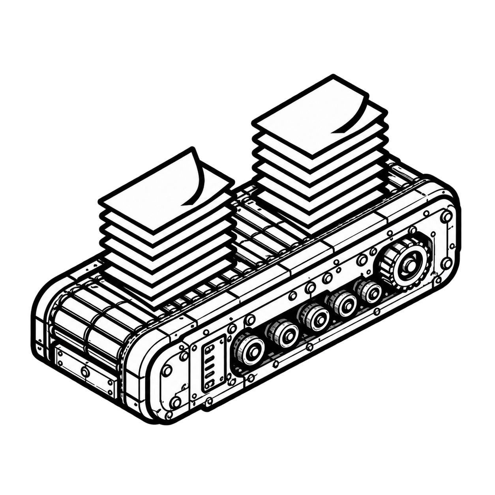
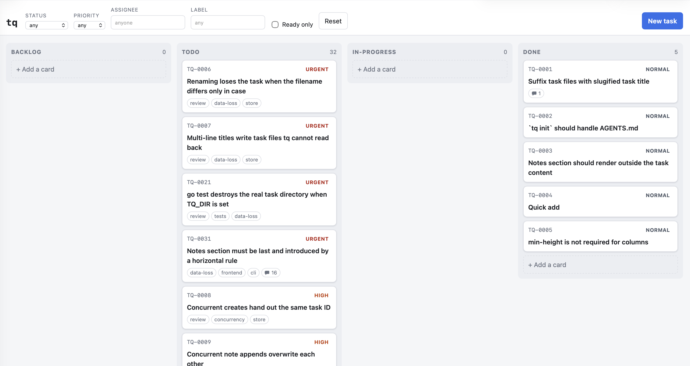

# tq — task queue

<div align="center"></div>

A local-first task queue for agentic software development.

> Markdown on disk, CLI for agents, Kanban for humans.

## Summary

Every task is a Markdown file with YAML frontmatter inside a `.tasks/` directory
in your repository. The filesystem is the database: no SQL, no service, no
account, no daemon required. Agents drive the deterministic CLI (with `--json`
everywhere it matters), humans drag cards around a Kanban board, and Git sees
plain text either way.

```text
.tasks/TQ-0001.md   ←  tq add / tq move / tq note        (agents, CLI)
                    ←  http://127.0.0.1:7331             (humans, board)
                    ←  git diff                          (review, history)
```

<div align="center"><a href="screenshots/board-1.png"></a></div>

## Install

```bash
go install github.com/fmartingr/taskqueue/cmd/tq@latest
```

Or take a [release archive](https://github.com/fmartingr/taskqueue/releases),
or build from source:

```bash
make build     # builds the frontend with Bun, then the Go binary
./tq version
```

The binary is self-contained: the web UI is embedded with `go:embed`, and Bun is
only needed at build time.

## Quick start

```bash
cd your-project
tq init                                        # mandatory: .tasks/ and .taskqueue.yaml
tq add "Implement REST API" --priority high --label backend
tq add "Build Kanban board" --label frontend --depends-on TQ-0001
tq ready                                       # what can be picked up right now
tq move TQ-0001 in-progress
tq note TQ-0001 "CRUD endpoints implemented; tests remain."
tq done TQ-0001
tq serve                                       # board on http://127.0.0.1:7331
```

`tq init` is **mandatory**. It creates `.tasks/` (at the root of the enclosing
Git repository, so running `tq` from a subdirectory does not scatter task
directories around the tree) and writes `.taskqueue.yaml` with the project
configuration. Other commands need both of those to exist. It is harmless to
repeat: besides the directory and the config it writes `.tasks/AGENTS.md` — a
short CLI cheat sheet for coding agents, generated from the statuses, priorities
and exit codes the binary actually implements.

Point your agents at it yourself, by referencing that guide from your
`AGENTS.md`, `CLAUDE.md` or whatever your tool reads — an `@.tasks/AGENTS.md`
include, a Markdown link, whatever the tool understands.

`tq init` prints the guide's full path every time, so you never have to
remember where it is; how you reference it, and from which file, is yours to
decide. It does not edit those files: they are yours, they are committed, and a
tool that rewrites a document it did not author eventually destroys something.

Commit `.tasks/` with your code — task history lives in the same repository as
the work it describes.

## The human workflow

```bash
tq serve                # http://127.0.0.1:7331 (localhost only, no auth)
```

- Four columns: `backlog`, `todo`, `in-progress`, `done`.
- Drag a card between columns to change its status.
- "+ Add a card" at the bottom of a column files a task straight into it:
  type a title and press Enter (the composer stays open for the next one) or
  click away. An empty card is discarded; Escape cancels.
- Click a card to edit title, status, priority, assignee, labels, dependencies
  and the Markdown body.
- Notes are not part of the body editor: they get their own list in the dialog,
  each with a pencil to correct it, and cards show a 💬 count. They are still
  stored as the trailing `## Notes` section of the Markdown file that `tq note`
  writes, so a `## Notes` heading in the body itself stays part of the body.
- "New task" creates a task; the filter bar narrows the board by status,
  priority, assignee, label, or "ready only".
- Cards show a blocked marker while a dependency is unfinished or missing.
- The board is live: the server watches the queue and pushes, so a task an agent
  creates or moves appears within about half a second, without a reload. A change
  that arrives while you are mid-drag or have a dialog open is held and applied
  the moment you are done, rather than moving the board under your hand. If the
  stream cannot be opened the board falls back to a three second poll and the
  footer says `polling`, so slower updates are always visible rather than
  silent.

## The agent workflow

Every query command speaks JSON, and in `--json` mode **stdout contains only
JSON** — diagnostics always go to stderr.

```bash
tq ready --json                       # pick work that is unblocked and unclaimed
tq show TQ-0001 --json                # read the full task, body included
tq move TQ-0001 in-progress           # claim it
tq note TQ-0001 "Login handler implemented."
tq done TQ-0001                       # finish it
```

A task is **ready** when it is neither `done` nor `in-progress`, and every task
in `depends_on` exists and is `done`. A missing dependency blocks a task rather
than silently making it ready, so a typo shows up as blocked work.

### Where the tasks live

`tq init` writes a marker at the repository root:

```yaml
# .taskqueue.yaml
version: 1
path: .tasks
```

That file is what `tq` looks for, walking up from the current directory and
stopping at the repository root, so any subdirectory of the project reaches the
same queue and a marker outside the repository is none of its business.
`path` is resolved against the directory holding the config — never against the
working directory — so the committed file means the same thing on every machine,
and moving the queue is a one-line edit.

The marker is the only thing `tq` looks for. A directory that happens to be
called `.tasks`, with no marker above it, is not adopted: guessing at names on
the way up is exactly what this replaces. You never have to write the file by
hand — `tq init` creates the directory and the marker together, which is why
it is mandatory. `tq` never rewrites a config you wrote.

`version` only changes on a breaking change; anything else is additive, so a
file written by a newer `tq` still reads here, and unknown keys are ignored. A
file declaring a version this binary does not understand is an error that says
so, rather than a silent partial read.

`TQ_DIR=/path/to/.tasks` overrides the search and `path` alike.
`TQ_WALK_FOREVER=true` lets the search continue past the repository root, for
one queue shared above several repositories.

### Where the server binds

`tq serve` listens on `127.0.0.1:7331` by default. A project can pin its own
address, so two checkouts served at once do not collide on the same port and
the browser tab stays bookmarkable:

```yaml
server:
  host: 127.0.0.1
  port: 7412
```

Both keys are optional and each stands alone. Precedence runs highest first:

| | |
| --- | --- |
| `--host`, `--port` | flags |
| `TQ_HOST`, `TQ_PORT` | environment |
| `server.host`, `server.port` | `.taskqueue.yaml`, committed with the project |
| `127.0.0.1`, `7331` | built in |

An environment variable that is set but empty reads as unset, so `TQ_HOST= tq
serve` falls through to the config rather than clearing it. To override a
committed address for a single run, pass the flag.

`port: 0` asks the operating system to pick a free one, which is what the test
harnesses use; the start-up banner always prints the address actually bound, so
there is something to read back. A port already in use is a real error rather
than a silent fallback — quietly moving would defeat the point of pinning one.
A port out of range or not a number, and a host that is neither an IP address
nor a hostname, are refused when the config loads, with the file named — a
bracketed `[::1]` included, since that spelling reaches the listener as
`[[::1]]:7331` and fails there with a message naming nothing useful.

**A committed `host` is a safety decision, not a convenience.** The board has no
authentication in front of it, so `host: 0.0.0.0` in a file everyone clones puts
every clone's task queue on whatever network it is run — a café, a conference,
an office VLAN. `tq` prints a warning on start-up whenever the bound host is not
a loopback address. Prefer leaving `host` out and passing `--host` when you
actually mean it.

### Columns

The board's columns are the `status` vocabulary, and a project declares them:

```yaml
columns:
  - name: spotted
    display_name: Spotted
    consider_ready: true
  - name: doing
    display_name: Doing
    default: true
  - name: shipped
    display_name: Shipped
    consider_done: true
```

The list is the board, left to right. `name` is what task frontmatter stores and
what `tq move` takes; `display_name` is only what the board shows.

Two flags define column semantics:

- **`ready: true`** — `tq ready` offers work from here. Left out, a column holds
  work that is unsorted, claimed or finished, and is not handed out.
- **`consider_done: true`** — a dependency parked here counts as
  complete, and `tq done` moves tasks to it. Exactly one column should claim it;
  with none or several, `tq done` says which way round it is rather than
  guessing.
- **`default: true`** — where a task filed without a status goes. Without it,
  the first column.

Like priorities and unlike labels, this is a closed set: `tq add --status`,
`tq move`, `tq update --status`, `POST /api/tasks` and `PATCH /api/tasks/{id}`
refuse a status the board has no column for, and list what it does have.

A task whose column the project has since removed is **shown in the first
column** — on the board, in `tq list`, in filters and in sorting — and the file
is corrected the next time that task is saved for some other reason. Reads never
write: a listing does not rewrite the directory it is listing.

The built-in board is Inbox, To do, In Progress, Done and Rejected.

**Inbox is intake, and `tq ready` does not offer it.** A task filed without a
status lands there, before anyone has decided it is worth doing; moving it to To
do is the triage step that turns something filed into something an agent is
handed. So `tq add` followed by `tq ready` will not show the task you just
added — `tq move <id> todo` is what puts it in the queue.

Note the deliberate asymmetry at the other end: **Rejected does not count as
done.** A task waiting on work somebody decided not to do is still blocked, and
saying otherwise would quietly treat "we will not do this" as "this is
finished".

`inbox` was called `backlog` until this landed. `backlog` is still accepted
everywhere as a spelling of `inbox` — in frontmatter, in `tq add --status`, in
`tq move` — so an existing queue keeps working; it resolves to `inbox` on the
next write. That alias is deprecated and goes in a future release.

### Labels

Labels are freeform: `--label` takes any string, and always has. What
`.taskqueue.yaml` adds is a *vocabulary* — the shared set a project agrees on —
which is what gives a label a colour and a display name on the board:

```yaml
labels:
  bug:
    color: "#d73a4a"
    display_name: Bug
  component/backend:
    color: "#1d76db"
    display_name: Backend
```

The key is the label exactly as task frontmatter stores it, and exactly what
`tq list --label component/backend` takes. A `/` groups labels **for display
only**, the way GitLab groups scoped labels: the board puts them under a heading
in the filter bar, and storage stays one flat string.

The set is a reference, not a restriction. A label outside it is accepted by
`tq add`, `tq update` and the API alike, and renders in a neutral colour rather
than failing — otherwise adopting a config would break every task already filed.
`tq label list` is where those turn up:

```text
LABEL              DISPLAY   COLOR    TASKS  SOURCE
bug                Bug       #d73a4a  4      config
component/backend  Backend   #1d76db  11     config
spike              spike     -        2      unconfigured
```

`tq init` writes the base set into the marker with the queue, so a new project
starts with a vocabulary rather than an empty one; edit it, and the board
follows. Hex colours **must be quoted** — unquoted, `#d73a4a` is a YAML comment
and the value parses as null, which `tq` rejects rather than drawing. Removing
the `labels` key restores the base set; `labels: {}` means the project wants no
vocabulary at all.

Each chip carries its own background, with its text picked for contrast against
that colour, so one set of colours stays readable in both the light and the dark
theme.

### Priorities

Priorities are the closed set labels are not. `.taskqueue.yaml` declares them,
and unlike labels they are **ordered** — the list *is* the ranking, most severe
first, which is what `tq list` and the board sort by. That is why this key is a
sequence and not a mapping: a YAML mapping has no order left to read once it is
parsed, and a `rank:` field would be one more thing to keep in step with itself.

```yaml
priorities:
  - name: p0
    color: "#b60205"
    display_name: "P0 — drop everything"
  - name: p1
    color: "#c2410c"
    display_name: P1
  - name: p2
    color: "#4b5563"
    display_name: P2
    default: true
```

`name` is what task frontmatter stores and what `--priority` takes, so nothing
about the file format changes: only which values are accepted, how they rank,
and how the board draws them. Exactly one entry carries `default: true` — it is
what a task filed without a priority gets — and zero or two is a config error
that says which. Hex colours **must be quoted**, for the same reason they must
be for labels.

Writes validate against the set. `tq add --priority`, `tq update --priority`,
`POST /api/tasks` and `PATCH /api/tasks/{id}` refuse anything else and list what
is valid; so does filtering, since a filter naming a value the project cannot
file would otherwise read as an empty queue.

Reads stay tolerant, so that editing the set does not break the tasks already
filed under the old one. A task carrying a value the project has since dropped
keeps it, sorts last, and renders in a neutral colour — and can still be moved,
retitled and closed. Only *changing* a priority has to agree with the vocabulary
as it stands now. Sorting last is also how you find them after an edit: they
collect at the bottom of `tq list`, where the old value is still in the column.

The CLI's help and the `--priority` flag help read the configured set on every
run, and the board builds its three selects and its badge colours from
`GET /api/config`, so both follow an edit immediately. The generated
`.tasks/AGENTS.md` prints the set too, but it is a file — **re-run `tq init`
after changing the vocabulary** so the guide agents read stops claiming the old
one. Removing the `priorities` key restores the built-in `urgent`, `high`,
`normal`, `low`.

### Exit codes

| Code | Meaning |
| --- | --- |
| `0` | success |
| `1` | general or validation error |
| `2` | task not found |
| `3` | the `.tasks` directory is missing and could not be created |

A task file that will not parse — a merge conflict in a committed `.tasks/`, a
key the format does not have — does not fail a listing. `tq list` and `tq ready`
print the tasks they could read, exit `0`, and name each file they skipped on
stderr, so `--json` stdout stays parseable and a script sees a queue that is
short rather than one that is empty. Reading a single task by ID still fails
loudly, because there the broken file is the answer.

Another process writing to `.tasks/` while a listing is being taken does not
cost it a task either: retitling moves a task's file, so a scan that read the
directory and then opened the files could miss one — or, caught a moment
earlier, read the same task under both names. The scan is checked against the
directory and retaken until the two agree. A listing that still cannot be
squared with the directory prints on stderr that it may be missing a task, and
still exits `0` with what it read.

Two files that go on claiming one ID are not a directory in motion but a queue
to fix: an interrupted retitle, a file copied by hand, two branches merged.
Both copies are left out of the listing — an ID identifies a task, and with two
files answering to one there is nothing to say which of them a reader means —
and `tq list` and `tq ready` name the ID and both files on stderr, in the same
words `tq show` refuses that ID with, and still exit `0`. Delete the copy you
do not want and the task comes back.

## CLI reference

```text
tq init                            Create .tasks/ and .taskqueue.yaml with
                                   the project configuration, and refresh
                                   the agent instructions. Mandatory.
tq add <title> [flags]             --priority --assignee --label --depends-on --body --status --json
tq list [flags]                    --status --priority --label --assignee --json
tq show <id> [--json]              Frontmatter fields followed by the Markdown body
tq move <id> <status>              backlog | todo | in-progress | done
tq done <id>                       Shorthand for: tq move <id> done
tq update <id> [flags]             --title --status --priority --assignee
                                   --add-label --remove-label
                                   --add-dependency --remove-dependency
tq note <id> <text>                Append a timestamped bullet to the notes
tq ready [flags]                   --priority --label --assignee --json
tq label list [--json]             The project's label vocabulary, with a count
                                   of what each label is on and a flag for the
                                   labels in use that the config does not declare
tq serve [flags]                   --host --port
tq version
```

`--label` and `--depends-on` (and the `--add-*`/`--remove-*` flags) can be
repeated. Only the fields you pass to `tq update` change.

Arguments that start with `-` must follow `--`, as usual:

```bash
tq note TQ-0001 -- "-1 test still failing"
```

## Task format

```markdown
---
id: TQ-0001
title: Implement OIDC authentication
status: in-progress
priority: high
assignee: agent-auth
labels:
  - backend
  - auth
depends_on:
  - TQ-0004
created: 2026-08-25T08:30:00+02:00
updated: 2026-08-25T09:12:00+02:00
---

Implement authentication using the existing OIDC provider.

---

## Notes

- 2026-08-25T09:42:00+02:00 — Initial investigation completed.
```

- Statuses: `inbox` (default), `todo`, `in-progress`, `done`, `rejected` — the
  board, left to right. The set is the project's, declared in `.taskqueue.yaml`;
  see [Columns](#columns).
- Priorities: `urgent`, `high`, `normal` (default), `low` — most severe first,
  which is also the order `tq list` sorts by. The set is the project's, declared
  in `.taskqueue.yaml`; see [Priorities](#priorities).
- Notes are the last section of the body and are introduced by a horizontal
  rule, so a `## Notes` heading in the body itself is content like any other:
  only a `## Notes` that ends the document is read as notes. The blank line
  above the `---` is required — text directly above it would make a heading
  instead of a rule. Files written before the rule existed are still read
  correctly and gain the rule the next time `tq note` touches them.
- Files are named `<id>-<title-slug>.md` (`TQ-0001-implement-oidc-authentication.md`),
  so the directory is browsable and greppable by name. The ID comes first, so
  files still sort and glob by ID.
- The extension is a lowercase `.md`, and matching it is not case-folded — that
  would make what tq sees in a directory depend on the filesystem. So a
  `TQ-0001-implement-oidc-authentication.MD`, however it arrived, is not a task
  file: tq does not read it, list it, claim its ID or rename it. It is named on
  stderr and in the board's footer the way an unparseable file is, and renaming
  it is yours to do.
- The `id` in the frontmatter is authoritative: tasks are looked up by ID
  whatever the suffix says, files written before this naming existed keep
  working, and retitling a task renames its file on the next write (Git records
  it as a rename).
- Writes are atomic (write to a temporary file, then rename), so a crash never
  leaves a half-written task behind.
- Frontmatter is strict: unknown fields are rejected rather than silently
  dropped on the next write.

## REST API

The server and the CLI call the same store, so there is no behavioural
difference between an agent moving a task and a human dragging a card.

| Method | Path | Notes |
| --- | --- | --- |
| `GET` | `/api/tasks` | filters: `status`, `priority`, `label`, `assignee`, `ready=true` |
| `POST` | `/api/tasks` | `{"title", "status", "priority", "assignee", "labels", "depends_on", "body"}` |
| `GET` | `/api/tasks/{id}` | one task |
| `PATCH` | `/api/tasks/{id}` | partial update; the drag-and-drop endpoint |
| `POST` | `/api/tasks/{id}/notes` | `{"text": "…"}` |
| `GET` | `/api/config` | the resolved project config: `{"version", "path", "task_dir", "file", "labels", "priorities", "columns"}` |
| `GET` | `/api/events` | server-sent events; a `tasks` frame when the queue changes, `config` when `.taskqueue.yaml` does, `scan-failed` when the queue cannot be read |
| `GET` | `/api/status` | `{"ok", "task_count", "task_dir", "version", "unreadable", "duplicated", "incomplete"}`; `unreadable` is `[{"file", "reason"}]` for the task files the scan had to skip, `duplicated` is `[{"id", "files", "reason"}]` for the IDs more than one file claims, which are left out of the listing entirely, and `incomplete` says the directory would not hold still long enough to be read consistently, so the listing may be missing a task |
| `GET` | `/api/version` | `{"version"}` |

Errors have a stable shape:

```json
{ "error": "task not found: TQ-9999", "code": "task_not_found" }
```

with `400` for malformed or invalid requests (including a malformed task ID or
an unparsable `ready` value), `404` for a well-formed ID that has no task, and
`500` for filesystem problems, a task file that will not parse where that file
is the answer (`GET`, `PATCH` and the note endpoint, all of which address one
task by ID), and a `.taskqueue.yaml` that will not parse (`invalid_config`) — a
marker caught half-saved is a file on the server, not anything the request got
wrong, and the board keeps the last configuration that worked rather than
blanking its labels for it.

A task file the server cannot read is skipped rather than failing the listing:
`GET /api/tasks` answers `200` with the tasks it could read, and `GET
/api/status` carries an `unreadable` array naming each file it could not and
why. One conflicted file is how a shared `.tasks/` breaks, and it must not hide
every other task — the board draws what it has and says what is missing.

A CLI write landing while a request is being served does not cost the listing a
task: the scan is checked against the directory before it is returned, and
retaken when the two disagree. `GET /api/status` reports `incomplete` for the
listing that could not be squared with the directory at all, and the board says
so in a toast and in its footer; `GET /api/tasks` stays an array of what was
read, because that is what every client parses.

An ID more than one file claims is not a listing that could not be squared with
the directory but a queue to fix — an interrupted retitle, a file copied by
hand, two branches merged. Both copies are left out: the ID is what identifies
a task, so with two files answering to one there is no saying which of them a
reader means, and showing either would be a guess that hides the other's edits.
`GET /api/status` names the ID and its files in `duplicated`, with the sentence
a write to that ID is refused with, and `tq list` and `tq ready` say the same
on stderr and still exit 0. Delete the copy you do not want and the task comes
back.

`tq serve` binds to `127.0.0.1:7331` by default, and a project can pin its own
address — see [Where the server binds](#where-the-server-binds) for the keys and
the precedence. There is no authentication, so think before binding to
`0.0.0.0`.

## Development

```bash
make help        # list targets
make dev         # Bun watch + Go server with DEV=1 (frontend served from ./public)
make test        # go test ./...
make typecheck   # vue-tsc over frontend/ and browser/, .ts and .vue alike
make test-frontend    # Bun unit tests for the pure frontend helpers
make test-integration # drives the compiled binary
make test-browser     # drives the board in a real Chromium (make browser-install first)
make lint        # golangci-lint
make format      # go fmt + go mod tidy
make frontend    # rebuild the embedded frontend with Bun
make build       # frontend + self-contained binary
```

Layout — a single `package main` at the repository root, as in
[terraria-companion](https://git.nakama.town/fmartingr/terraria-companion):

```text
cmd/tq/               The binary
internal/task/        Task model, validation, filtering, dependencies, notes
internal/config/      .taskqueue.yaml: the project marker, its loader and the
                      label and priority vocabularies
internal/store/       Filesystem store: discovery, atomic writes, ID allocation
internal/web/         net/http server, REST API, and the built frontend
internal/cli/         Commands, flags, table/JSON output, exit codes
frontend/             Vue 3 components, TypeScript, CSS and HTML (Bun builds them)
browser/              End-to-end tests driving the board in a real browser
```

`internal/web/public/` is generated by `make frontend` and is committed so that
`go build`, `go test` and releases work without Bun (it is embedded, so the
package does not compile while it is missing). `DEV=1` serves it from disk
instead of the embedded copy, so Bun rebuilds show up on reload.

The frontend is Vue 3 with TypeScript, bundled by Bun and no other tool. Vue is
bundled into `app.js`, so the page still loads exactly one script and fetches
nothing at runtime; the binary that ships it needs neither Bun nor Node.

Types are checked separately from the build. `bun build` erases them without
looking, so `make typecheck` is the only thing that reads them — without it a
`const n: number = "x"` compiles, lands in the committed `public/app.js` and is
embedded in the release binary. It runs `vue-tsc`, which is a superset of `tsc`,
so one pass covers the `.ts` files and the templates inside the `.vue` ones
alike. Both it and `typescript` are pinned exactly and neither reaches the
shipped output: TypeScript 7's Go-native port ships no programmatic API, so
`vue-tsc` cannot run on it at all.

`public/app.js` is 217 KB, most of it Vue itself, and it is committed
unminified on purpose: it is an artifact that gets reviewed, and 59 KB on one
unreadable line would be a worse thing to have in the repository than 217 KB
that still diffs. A clean checkout needs `bun install` before `make frontend`,
`make typecheck` or `make dev` will run.

## Known limitations (deliberate, for now)

- Two tq processes creating a task at the same instant can race for the same ID.
  Within one process — a server, however many requests — allocation is
  serialised, and a losing racer takes the next ID rather than overwriting.
- Across processes, simultaneous edits are last-writer-wins, and an appended
  note is lost outright rather than merged. Within one process, a task's
  read-modify-write is serialised, so concurrent notes all survive. Writes are
  atomic either way.
- No authentication; the server binds to localhost.
- Every request scans the task directory, and so does the event ticker while a
  board is connected. Fine at PoC scale.
- The board is one project per server.
- Task bodies are edited as plain Markdown; nothing is rendered.
- The board is pushed to over server-sent events, and falls back to a three
  second poll when the stream is unavailable. The server notices changes by
  re-reading the task directory twice a second rather than by watching the
  filesystem, so that tick is the worst case a change ever waits — measured at
  ~500 ms from `tq add` in a terminal to the board being told.
